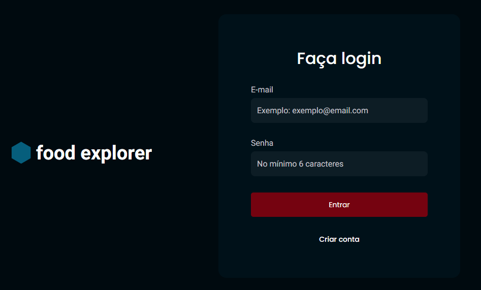
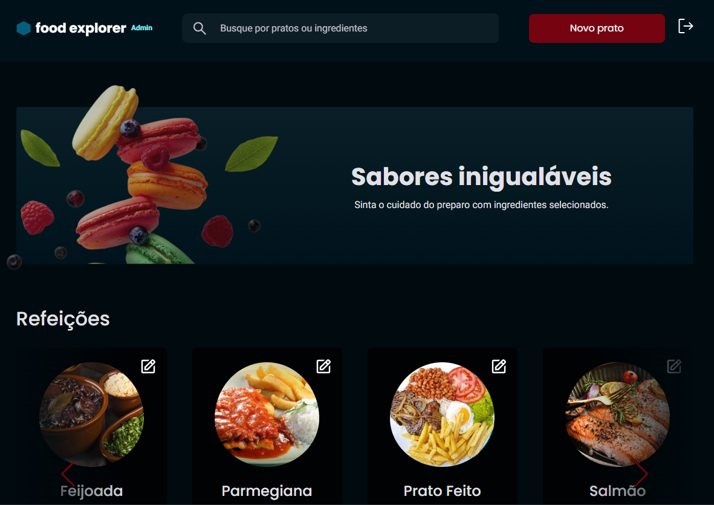

# Food Explorer - Frontend

O Food Explorer faz parte do desafio final do programa Explorer da Rocketseat. O objetivo do projeto é desenvolver uma aplicação completa de um restaurante fictício, que permita aos usuários visualizar e explorar o menu disponível.

O projeto utiliza as tecnologias e ferramentas aprendidas ao longo do programa Explorer, incluindo o uso do React para construir a interface do usuário, o Axios para fazer requisições à API, o React Router DOM para a navegação entre páginas, e o Styled Components para estilização dos componentes.

A aplicação foi desenvolvida de forma responsiva, visando proporcionar uma experiência consistente em diferentes tamanhos de tela, desde dispositivos móveis até desktops.

## Acesso

Link para aplicação e login com a visão administrativa do projeto.

Link: 

user: admin@email.com

password: 123456

## Deploy

Para o deploy da frontend da aplicação, utilizamos o Netlify.
(https://www.netlify.com/)

## Preview




## Tecnologias Utilizadas

O frontend do Food Explorer utiliza as seguintes tecnologias:

- 
- 
- 
- 

## Dependências

O projeto utiliza as seguintes dependências:

- axios
- react
- react-dom
- react-icons
- react-router-dom
- styled-components
- swiper

## Instalação

Para executar o frontend do Food Explorer, siga as instruções abaixo:

1. Certifique-se de que o backend do Food Explorer esteja em execução e acessível através de uma API.

2. Clone o repositório do frontend para sua máquina local:

```
git clone https://github.com/seu-usuario/food-explorer-frontend.git
```

3. Acesse o diretório do frontend:

```
cd food-explorer-frontend
```

4. Instale as dependências do projeto:

```
npm install
```

5. Inicie o servidor de desenvolvimento:

```
npm run dev
```

O frontend estará disponível em http://localhost:3000.

## Autor

- Nome: Felipe Diego Tamura
- Contato:
  - [](mailto:tamurafelipe@gmail.com)
  - [](https://www.linkedin.com/in/felipe-diego-tamura/)

## Licença

Este projeto está licenciado sob a licença [ISC](https://opensource.org)